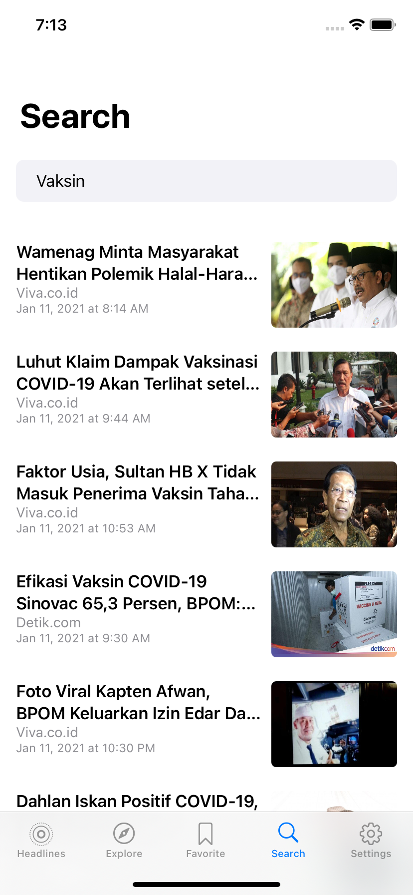
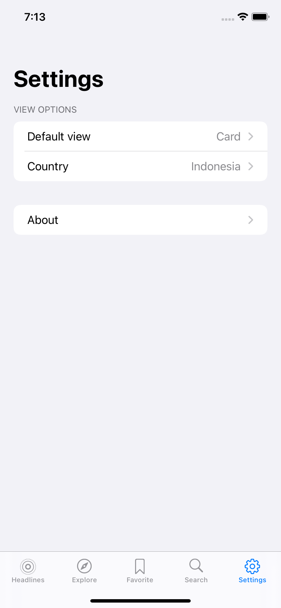

# Maca Warta

[](https://travis-ci.com/comprimasantosa/ios-swift-macawarta)

Maca Warta is an app to read, explore, and search news around the world. You can also add important news to favorite. 

## Branches
* main -> Monolith approach
* modularization -> Modular approach

## Screenshots

<p float="left">





</p>

## Getting Started

These instructions will get you a copy of the project up and running on your local machine for development and testing purposes. See deployment for notes on how to deploy the project on a live system.

### Prerequisites

* Xcode 12.2 or latest

### Installing

```
1. Clone or download this project
2. Open the project using Xcode
3. Register for NewsAPI token and put it on MacaWarta/News-Info.plist
4. Run using an iOS simulator or real device
```

## Built With

* SwiftUI
* KingfisherSwiftUI
* Realm
* Alamofire
* Clean architecture

## Author

Prima Santosa - mauliawan@primasantosa.com

## License
This project is licensed under the MIT License - see the [LICENSE](LICENSE) file for details
